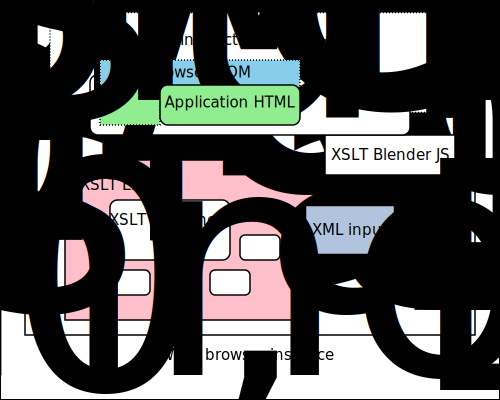

# XSLT Blender Architecture

The wiki page on [Architecture](wiki/Architecture) gives a full description of the architecture including a long description of the diagram below.

The illustration shows static and dynamic components of a generic XSLT Blender application.

Note that while calling it *XSLT Blender* here, there is nothing about that name - this is only and nothing more than XSLT 1.0 supported by Javascript. Anyone could write the Javascript and call it something else: this architecture also may describe other (simple) web applications incorporating XSLT 1.0.
